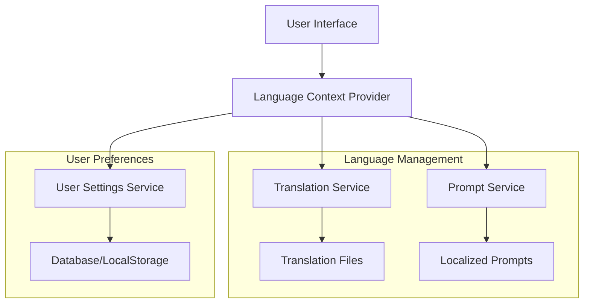

# Design Document

## Overview

Система многоязычности для UX-анализ сервиса будет реализована как модульная архитектура с поддержкой интернационализации (i18n). Система включает в себя переводы интерфейса, локализованные промпты для анализа, и механизм управления языковыми настройками пользователей.

Ключевые принципы дизайна:
- **Поэтапная реализация**: Сначала добавляем английский язык, затем создаем инструкцию для масштабирования
- **Обратная совместимость**: Существующий функционал не должен быть нарушен
- **Fallback механизм**: При отсутствии перевода используется русский язык
- **Производительность**: Переводы загружаются только для выбранного языка
- **Простота добавления**: Новые языки добавляются через стандартизированный процесс

## Architecture

### High-Level Architecture



### Component Architecture

1. **Language Context Provider** - React Context для управления текущим языком
2. **Translation Service** - Сервис для загрузки и получения переводов
3. **Prompt Service** - Сервис для загрузки локализованных промптов
4. **Language Selector** - UI компонент для выбора языка
5. **User Settings Service** - Сервис для сохранения языковых предпочтений

## Components and Interfaces

### 1. Language Context Provider

```typescript
interface LanguageContextType {
  currentLanguage: string
  availableLanguages: Language[]
  setLanguage: (language: string) => Promise<void>
  t: (key: string, params?: Record<string, string>) => string
  isLoading: boolean
}

interface Language {
  code: string
  name: string
  nativeName: string
  flag: string
  isRTL?: boolean
}
```

### 2. Translation Service

```typescript
interface TranslationService {
  loadTranslations(language: string): Promise<TranslationMap>
  getTranslation(key: string, language: string, params?: Record<string, string>): string
  hasTranslation(key: string, language: string): boolean
  getFallbackTranslation(key: string, params?: Record<string, string>): string
}

interface TranslationMap {
  [key: string]: string | TranslationMap
}
```

### 3. Prompt Service

```typescript
interface PromptService {
  loadPrompt(promptType: PromptType, language: string): Promise<string>
  getAvailablePrompts(language: string): Promise<PromptType[]>
  combineWithContext(prompt: string, context?: string, language: string): string
}

enum PromptType {
  MAIN = 'main',
  JSON_STRUCTURED = 'json-structured',
  SONOMA_STRUCTURED = 'sonoma-structured',
  AB_TEST = 'ab-test',
  BUSINESS_ANALYTICS = 'business-analytics',
  HYPOTHESES = 'hypotheses'
}
```

### 4. Language Selector Component

```typescript
interface LanguageSelectorProps {
  variant?: 'header' | 'settings'
  showFlags?: boolean
  showNativeNames?: boolean
  className?: string
}
```

### 5. User Settings Service

```typescript
interface UserSettingsService {
  saveLanguagePreference(userId: string, language: string): Promise<void>
  getLanguagePreference(userId: string): Promise<string | null>
  saveToLocalStorage(language: string): void
  getFromLocalStorage(): string | null
}
```

## Data Models

### 1. Translation File Structure

```json
{
  "common": {
    "loading": "Loading...",
    "save": "Save",
    "cancel": "Cancel",
    "error": "Error",
    "success": "Success"
  },
  "navigation": {
    "quickAnalysis": "Quick Analysis",
    "myProjects": "My Projects",
    "settings": "Settings"
  },
  "analysis": {
    "title": "UX Analysis",
    "uploadImage": "Upload Image",
    "addContext": "Add Context",
    "startAnalysis": "Start Analysis"
  },
  "settings": {
    "profile": "Profile",
    "interface": "Interface",
    "language": "Language",
    "notifications": "Notifications"
  }
}
```

### 2. Language Configuration

```typescript
interface LanguageConfig {
  code: string
  name: string
  nativeName: string
  flag: string
  isRTL: boolean
  dateFormat: string
  numberFormat: Intl.NumberFormatOptions
  prompts: {
    [key in PromptType]: string
  }
}
```

### 3. User Language Preference (Database)

```sql
-- Добавляем колонку в таблицу profiles
ALTER TABLE profiles ADD COLUMN preferred_language VARCHAR(5) DEFAULT 'ru';

-- Индекс для быстрого поиска
CREATE INDEX idx_profiles_preferred_language ON profiles(preferred_language);
```

## File Structure

```
src/
├── lib/
│   ├── i18n/
│   │   ├── index.ts                 # Main i18n configuration
│   │   ├── translation-service.ts   # Translation service
│   │   ├── prompt-service.ts        # Localized prompt service
│   │   └── user-settings.ts         # User language preferences
│   └── ...
├── locales/
│   ├── ru/
│   │   ├── common.json
│   │   ├── navigation.json
│   │   ├── analysis.json
│   │   └── settings.json
│   └── en/
│       ├── common.json
│       ├── navigation.json
│       ├── analysis.json
│       └── settings.json
├── prompts/
│   ├── ru/
│   │   ├── main-prompt.md
│   │   ├── json-structured-prompt.md
│   │   └── ...
│   └── en/
│       ├── main-prompt.md
│       ├── json-structured-prompt.md
│       └── ...
├── components/
│   ├── language-selector.tsx
│   ├── language-provider.tsx
│   └── ...
└── hooks/
    ├── use-translation.ts
    └── use-language.ts
```

## Error Handling

### 1. Translation Fallback Strategy

1. **Primary**: Запрашиваемый перевод на выбранном языке
2. **Secondary**: Тот же ключ на русском языке (fallback)
3. **Tertiary**: Ключ перевода как есть (для отладки)

```typescript
function getTranslation(key: string, language: string): string {
  // 1. Попытка получить перевод на выбранном языке
  const translation = translations[language]?.[key]
  if (translation) return translation
  
  // 2. Fallback на русский язык
  const fallback = translations['ru']?.[key]
  if (fallback) return fallback
  
  // 3. Возвращаем ключ для отладки
  return `[${key}]`
}
```

### 2. Prompt Loading Error Handling

```typescript
async function loadPrompt(type: PromptType, language: string): Promise<string> {
  try {
    // Попытка загрузить промпт на выбранном языке
    return await loadPromptFile(`prompts/${language}/${type}.md`)
  } catch (error) {
    console.warn(`Prompt not found for ${language}, falling back to Russian`)
    
    try {
      // Fallback на русский язык
      return await loadPromptFile(`prompts/ru/${type}.md`)
    } catch (fallbackError) {
      console.error('Failed to load fallback prompt', fallbackError)
      // Возвращаем базовый промпт
      return getBasicPrompt(type)
    }
  }
}
```

### 3. User Settings Error Handling

- При ошибке сохранения в базу данных - сохраняем в localStorage
- При ошибке загрузки настроек - используем браузерную локаль или русский по умолчанию
- Логирование всех ошибок для мониторинга

## Testing Strategy

### 1. Unit Tests

- **Translation Service**: Тестирование загрузки переводов, fallback механизма
- **Prompt Service**: Тестирование загрузки промптов, обработки ошибок
- **Language Context**: Тестирование переключения языков, сохранения настроек

### 2. Integration Tests

- **Language Selector**: Тестирование UI компонента выбора языка
- **Settings Page**: Тестирование сохранения языковых настроек
- **Analysis Flow**: Тестирование анализа на разных языках

### 3. E2E Tests

- **Full Language Switch**: Полное переключение языка от выбора до анализа
- **Persistence**: Сохранение языковых настроек между сессиями
- **Fallback Scenarios**: Тестирование fallback при отсутствии переводов

### 4. Performance Tests

- **Translation Loading**: Время загрузки переводов
- **Prompt Loading**: Время загрузки промптов
- **Memory Usage**: Потребление памяти при переключении языков

## Implementation Phases

### Phase 1: Foundation (English Language)

1. Создание базовой инфраструктуры i18n
2. Добавление английских переводов для ключевых страниц
3. Создание английских промптов
4. Реализация Language Selector в header и settings
5. Базовое сохранение настроек в localStorage

### Phase 2: User Preferences & Database

1. Добавление поддержки сохранения в базу данных
2. Синхронизация между устройствами для авторизованных пользователей
3. Улучшение UX переключения языков
4. Добавление индикаторов языка анализов

### Phase 3: Documentation & Scaling

1. Создание подробной инструкции по добавлению языков
2. Автоматизация проверки переводов
3. Инструменты для валидации промптов
4. Подготовка к добавлению третьего языка

### Phase 4: Advanced Features

1. Автоматическое определение языка браузера
2. Локализация дат и чисел
3. Поддержка RTL языков (при необходимости)
4. A/B тестирование переводов

## Security Considerations

1. **XSS Protection**: Все переводы должны быть экранированы
2. **Input Validation**: Валидация языковых кодов
3. **File Access**: Безопасная загрузка файлов переводов и промптов
4. **User Data**: Защита языковых предпочтений пользователей

## Performance Considerations

1. **Lazy Loading**: Переводы загружаются только для выбранного языка
2. **Caching**: Кэширование переводов в памяти
3. **Bundle Size**: Минимизация размера бандла за счет динамической загрузки
4. **CDN**: Возможность размещения переводов на CDN для быстрой загрузки

## Monitoring and Analytics

1. **Language Usage**: Отслеживание популярности языков
2. **Translation Errors**: Мониторинг отсутствующих переводов
3. **Performance Metrics**: Время загрузки переводов и промптов
4. **User Behavior**: Анализ поведения пользователей при переключении языков