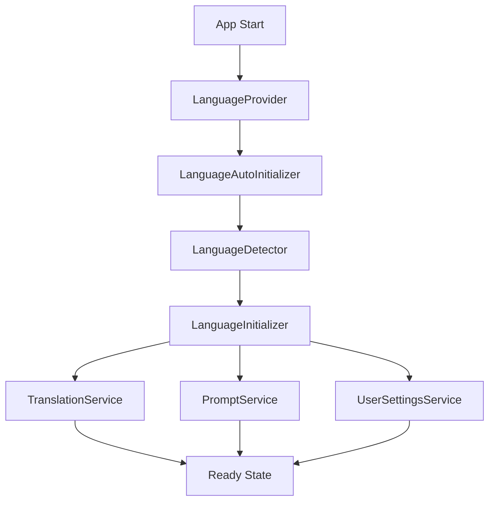

# Система инициализации языка

Данная документация описывает систему автоматического определения и инициализации языка в приложении.

## Обзор

Система инициализации языка состоит из нескольких компонентов:

1. **LanguageDetector** - определяет предпочтительный язык пользователя
2. **LanguageInitializer** - инициализирует языковую систему при запуске
3. **LanguageReadinessChecker** - проверяет готовность системы
4. **Хуки и компоненты** - для интеграции с React

## Архитектура



## Процесс инициализации

### 1. Определение языка (LanguageDetector)

Система определяет язык в следующем порядке приоритета:

1. **Настройки пользователя в базе данных** (confidence: 1.0)
2. **localStorage браузера** (confidence: 0.9)
3. **Настройки браузера** (confidence: 0.7)
4. **Язык по умолчанию** (confidence: 0.5)

```typescript
const result = await languageDetector.detectLanguage()
// {
//   language: 'en',
//   source: 'browser',
//   confidence: 0.7
// }
```

### 2. Инициализация системы (LanguageInitializer)

Система поддерживает два режима инициализации:

#### Быстрая инициализация
```typescript
const result = await languageInitializer.quickInitialize()
```

- Загружает только основные переводы
- Промпты загружаются по требованию
- Время инициализации: ~100-300ms

#### Полная инициализация
```typescript
const result = await languageInitializer.initialize()
```

- Предзагружает все переводы и промпты
- Синхронизирует настройки пользователя
- Время инициализации: ~500-1000ms

### 3. Проверка готовности (LanguageReadinessChecker)

```typescript
const readiness = await languageReadinessChecker.checkReadiness()
// {
//   isReady: true,
//   language: 'en',
//   checks: {
//     initialization: true,
//     translations: true,
//     prompts: true,
//     userSettings: true
//   },
//   errors: [],
//   warnings: []
// }
```

## Использование в компонентах

### Автоматическая инициализация

```tsx
import { LanguageAutoInitializer } from '@/components/language-auto-initializer'

function App() {
  return (
    <LanguageProvider>
      <LanguageAutoInitializer 
        showStatus={process.env.NODE_ENV === 'development'}
        quickInit={true}
      />
      {/* Остальное приложение */}
    </LanguageProvider>
  )
}
```

### Плавная инициализация с экраном загрузки

```tsx
import { SmoothLanguageInitializer } from '@/components/smooth-language-initializer'

function App() {
  return (
    <LanguageProvider>
      <SmoothLanguageInitializer
        showLoadingScreen={true}
        loadingMessage="Загрузка языковых настроек..."
        minLoadingTime={300}
      >
        {/* Контент приложения */}
      </SmoothLanguageInitializer>
    </LanguageProvider>
  )
}
```

### Использование хуков

#### useLanguageInitialization

```tsx
import { useLanguageInitialization } from '@/hooks/use-language-initialization'

function MyComponent() {
  const {
    isInitializing,
    isInitialized,
    initializationResult,
    error,
    initialize,
    quickInitialize,
    reinitialize
  } = useLanguageInitialization()

  if (isInitializing) {
    return <div>Инициализация...</div>
  }

  if (error) {
    return <div>Ошибка: {error}</div>
  }

  return <div>Система готова!</div>
}
```

#### useBrowserLanguageDetection

```tsx
import { useBrowserLanguageDetection } from '@/hooks/use-browser-language-detection'

function LanguageDetector() {
  const {
    isDetecting,
    detectionResult,
    error,
    detectLanguage
  } = useBrowserLanguageDetection()

  return (
    <div>
      <button onClick={detectLanguage} disabled={isDetecting}>
        Определить язык
      </button>
      {detectionResult && (
        <div>
          Язык: {detectionResult.language}
          Источник: {detectionResult.source}
          Уверенность: {detectionResult.confidence * 100}%
        </div>
      )}
    </div>
  )
}
```

#### useLanguageReadiness

```tsx
import { useLanguageReadiness } from '@/hooks/use-language-readiness'

function ReadinessChecker() {
  const {
    isChecking,
    isReady,
    result,
    checkReadiness,
    quickCheck
  } = useLanguageReadiness()

  return (
    <div>
      <button onClick={() => checkReadiness()}>
        Проверить готовность
      </button>
      {result && (
        <div>
          Система {result.isReady ? 'готова' : 'не готова'}
          {result.errors.length > 0 && (
            <div>Ошибки: {result.errors.join(', ')}</div>
          )}
        </div>
      )}
    </div>
  )
}
```

## Компоненты для отладки

### LanguageDetectionDebug

Показывает информацию о определении языка в режиме разработки:

```tsx
import { LanguageDetectionDebug } from '@/components/language-detection-debug'

// Автоматически скрывается в продакшене
<LanguageDetectionDebug />
```

### LanguageInitializationTest

Компонент для тестирования инициализации:

```tsx
import { LanguageInitializationTest } from '@/components/language-initialization-test'

// Только в режиме разработки
<LanguageInitializationTest />
```

### LanguageInitializationStatus

Показывает статус инициализации:

```tsx
import { LanguageInitializationStatus } from '@/components/language-initialization-status'

<LanguageInitializationStatus 
  showDetails={true}
  autoHide={true}
  autoHideDelay={3000}
/>
```

## Обработка ошибок

Система включает комплексную обработку ошибок:

### Fallback механизмы

1. **Переводы**: Если перевод не найден → fallback на русский → показать ключ
2. **Промпты**: Если промпт не найден → fallback на русский → базовый промпт
3. **Инициализация**: Если инициализация не удалась → язык по умолчанию

### Логирование

```typescript
// Все ошибки логируются с контекстом
console.error('❌ Language detection failed:', error)
console.warn('⚠️ Failed to load translations for:', language)
console.log('✅ Language system initialized:', result)
```

## Производительность

### Оптимизации

1. **Lazy loading** - переводы загружаются только для выбранного языка
2. **Caching** - переводы кэшируются в памяти
3. **Quick init** - быстрая инициализация для улучшения UX
4. **Background loading** - полная инициализация в фоне

### Метрики

- Быстрая инициализация: ~100-300ms
- Полная инициализация: ~500-1000ms
- Переключение языка: ~50-200ms

## Тестирование

### Автоматические тесты

```bash
npm test -- src/lib/i18n/__tests__/language-initialization.test.ts
```

### Ручное тестирование

1. Откройте приложение в режиме разработки
2. Используйте компонент `LanguageInitializationTest`
3. Проверьте консоль браузера на наличие логов

### Тестовые сценарии

1. **Первое посещение** - должен определиться язык браузера
2. **Повторное посещение** - должен загрузиться сохраненный язык
3. **Смена языка** - должен сохраниться новый выбор
4. **Ошибки сети** - должны работать fallback механизмы

## Мониторинг

### Отчеты

```typescript
// Отчет о определении языка
const detectionReport = await languageDetector.generateDetectionReport()

// Отчет об инициализации
const initReport = await languageInitializer.generateInitializationReport()

// Отчет о готовности
const readinessReport = await languageReadinessChecker.generateReadinessReport()
```

### Метрики для отслеживания

1. Время инициализации
2. Частота ошибок
3. Популярность языков
4. Источники определения языка

## Требования

Данная реализация покрывает следующие требования из спецификации:

- **1.4**: Автоматическое применение ранее выбранного языка ✅
- **6.4**: Обновление только текстовых элементов при переключении ✅

## Заключение

Система инициализации языка обеспечивает:

- Автоматическое определение предпочтительного языка
- Быстрый запуск приложения
- Надежную обработку ошибок
- Удобные инструменты для разработки и отладки
- Готовность к масштабированию на новые языки